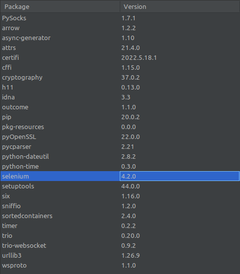

# WSB_asta
Projekt zaliczeniowy na WSB tester oprogramowania \
z wykorzystaniem https://demo.seleniumeasy.com/

## Strona z zadaniami testowymi
https://demo.seleniumeasy.com/

## Przygotowanie środowiska
System Operacyjny: Linux Mint 20.3 Cinnamon \
Python 3.8.10 \
pip 20.0.2

## stworzone środowisko wirtualne (venv)
zgodnie z instrukcją: \
https://www.infoworld.com/article/3239675/virtualenv-and-venv-python-virtual-environments-explai
ned.html

    python -m venv ./venv

Jeśli brakuje pakiety do środowiska wirtualnego należy doinstalować:

    apt install python3.8-venv

bez tego elementu nie generowały się pliki do aktywacji środowiska wirtualnego.

aktywacja środowiska w terminalu:

    source venv/bin/activate

## Przygotowanie sterowników do przeglądarek:
instrukcja:

    https://selenium-python.readthedocs.io/installation.html

pobrane wersje sterowników:

    ChromeDriver 102.0.5005.61
    geckodriver 0.31.0

Instrukcja mówi aby pobrane pliki umieścić w katalogach:
    
    /usr/bin
    lub
    /usr/local/bin - wybrane przeze mnie

## Widok wersji pakietów

